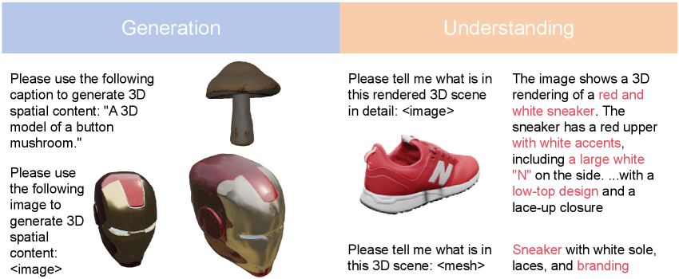
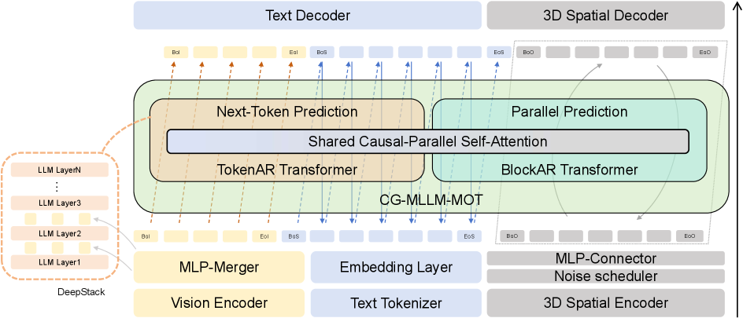

<h1 align="center">CG-MLLM</h1>

<p align="center">
  
  
  <a href="https://arxiv.org/abs/2601.21798">
    
  </a>
  <a href="https://github.com/dreaming-huang/CG-MLLM">
    
  </a>
  <a href="https://huggingface.co/JreamH/CGMLLM">
    
  </a>
</p>

# Captioning and Generating 3D content via Multi-modal Large Language Models

> Junming Huang, Chi Wang, Letian Li, Guangkai Xu, Donglin Huang, Hao Chen, Qiang Dai, Weiwei Xu
>
> We present **CG-MLLM**, a unified multimodal large language model for 3D captioning and high-fidelity 3D content generation. CG-MLLM brings language, image, and 3D spatial content into a single framework, enabling multimodal understanding and detailed 3D object generation with strong spatial consistency.

<p align="center">
  
</p>

This repository contains the **inference** code.

## News

- **2026-09-07**: Inference code and **v0.1** checkpoint are released. Weights: [JreamH/CGMLLM](https://huggingface.co/JreamH/CGMLLM).
- **2026-05-07**: 🎉 Our paper **CG-MLLM: Captioning and Generating 3D content via Multi-modal Large Language Models** has been accepted to ICML 2026. See you in Seoul!

## Overview

Unlike prior 3D MLLM methods that often generate low-resolution meshes, textualized mesh tokens, or coarse structural proxies, CG-MLLM integrates a pretrained vision-language backbone with a specialized 3D VAE latent space. This design allows the model to perform end-to-end 3D generation within the MLLM paradigm while preserving fine-grained geometry.

<p align="center">
  
</p>

## Features

1. Image understanding
2. Image to 3D object
3. Text to 3D object
4. Text to text
5. 3D object understanding

## Installation

```bash
git clone https://github.com/dreaming-huang/CG-MLLM.git
cd CG-MLLM
conda create -n cgmllm python=3.10 -y
conda activate cgmllm
pip install -r requirements.txt
pip install flash_attn==2.5.8 --no-build-isolation
```

Download the BAGEL image VAE used to initialize the visual encoder config:

```bash
hf download ByteDance-Seed/BAGEL-7B-MoT ae.safetensors --local-dir models/BAGEL-7B-MoT
```

The Hunyuan3D-2.1 shape VAE is loaded from Hugging Face (`tencent/Hunyuan3D-2.1`) at runtime.

## Checkpoint

**v0.1** weights: **[JreamH/CGMLLM](https://huggingface.co/JreamH/CGMLLM)**.
Download the checkpoint so `--checkpoint` can find `ema.safetensors`:

```bash
hf download JreamH/CGMLLM ema.safetensors --local-dir models/CGMLLM
```

## Inference

Interactive menu:

```bash
python inference.py \
  --llm_base_path Qwen/Qwen3-VL-2B-Instruct \
  --checkpoint models/CGMLLM \
  --obj_vae_path tencent/Hunyuan3D-2.1 \
  --obj_vae_len 4096 \
  --use_qwen_vit --use_qwen_vl --qk_norm \
  --timestep_shift 3.0 --img_cfg 7.5 --txt_cfg 7.5
```

Single-task examples:

```bash
# Image to 3D
python inference.py --checkpoint models/CGMLLM --use_qwen_vit --use_qwen_vl --qk_norm \
  --mode i2obj --image examples/chairo.png

# Text to 3D
python inference.py --checkpoint models/CGMLLM --use_qwen_vit --use_qwen_vl --qk_norm \
  --mode t2obj --prompt "A medieval knight in T-pose, metallic armor with decorative trim, holding a sword and shield."

# Image understanding
python inference.py --checkpoint models/CGMLLM --use_qwen_vit --use_qwen_vl --qk_norm \
  --mode img_und --image examples/chairo.png --prompt "Describe the object in the image."

# 3D understanding with PointBERT
python inference.py --checkpoint models/CGMLLM --use_qwen_vit --use_qwen_vl --qk_norm \
  --und_obj_vae_path /path/to/point_bert_v1.1.pt \
  --mode obj_und --obj examples/0ea33b6617174530b97d6b7a92c275fb_8192.npy \
  --prompt "What does this collection of points represent?"
```

Generated meshes are written to `--output_dir` (default: `<checkpoint>/output_images`).

## Results

| Method | p-FID(↓) | p-KID(↓) | clipiqa+(↑) | musiq(↑) | clip(↑) | user-study(↑) |
| --- | ---: | ---: | ---: | ---: | ---: | ---: |
| **Diffusion-Base** |  |  |  |  |  |  |
| michelangelo | 17.96 | 0.56 | 0.45 | 71.42 | 84.08 | 2.6 |
| craftsman | 14.09 | 0.4 | 0.45 | 71.09 | 84.86 | 3.15 |
| hunyuan3d-2.1 | 16.8 | 0.53 | 0.47 | 71.2 | 85.11 | 3.15 |
| trellis | 7.36 | 0.12 | 0.44 | 66.97 | 84.13 | 3.28 |
| sam3d | 33.92 | 1.13 | 0.47 | 70.21 | 84.67 | 3.45 |
| **MLLM-Base** |  |  |  |  |  |  |
| sar3d | 30.07 | 1 | 0.42 | 66.01 | 82.86 | 2.93 |
| shapellm-omni | 13.11 | 0.29 | 0.37 | 55.71 | 84.18 | 2.3 |
| **ours** | **12.55** | **0.27** | **0.45** | **71.65** | **84.47** | **3.32** |

## Acknowledgements

This inference code is built on [BAGEL](https://github.com/ByteDance-Seed/Bagel) and the [Hunyuan3D](https://github.com/Tencent-Hunyuan/Hunyuan3D-2.1) shape VAE. Please follow their licenses when using those components.

We thank the open-source research community and the authors of the foundation models and 3D generation systems that make this research possible.
