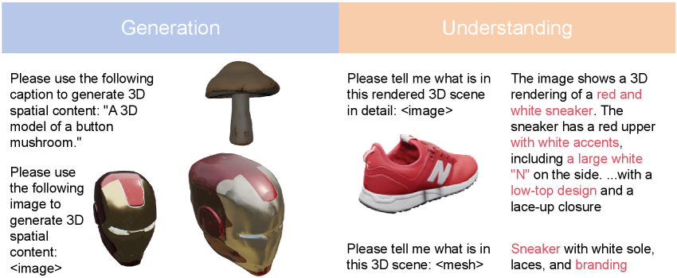
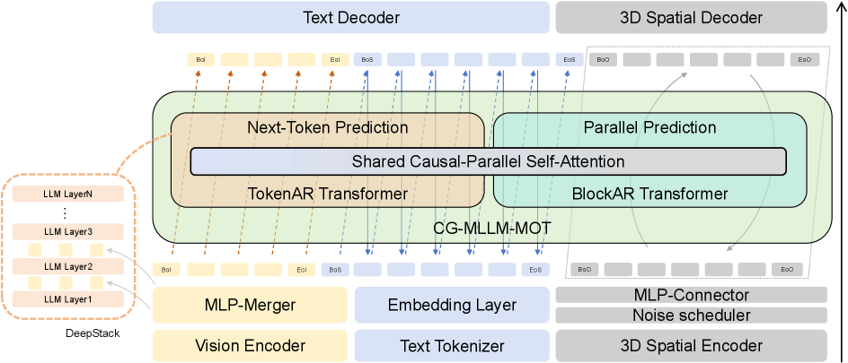

<p align="center">
  <h1 align="center"><strong>CG-MLLM: Captioning and Generating 3D content via Multi-modal Large Language Models</strong></h1>
</p>

<p align="center">
    Junming Huang<sup>1,2</sup>,
    Chi Wang<sup>1</sup>,
    Letian Li<sup>1,2</sup>,
    Guangkai Xu<sup>1</sup>,
    Donglin Huang<sup>1</sup>,
    Hao Chen<sup>1</sup>,
    Qiang Dai<sup>2</sup>,
    Weiwei Xu<sup>1</sup>
    <br>
    <sup>1</sup>Zhejiang University,
    <sup>2</sup>LIGHTSPEED
</p>

<h3 align="center">ICML 2026</h3>

<div align="center">

<a href="https://cv.jream.top/CG-MLLM-page/"></a> &nbsp;&nbsp;&nbsp;&nbsp;
<a href="https://arxiv.org/abs/2601.21798"></a> &nbsp;&nbsp;&nbsp;&nbsp;
<a href="https://huggingface.co/JreamH/CGMLLM-4B-i2o"></a> &nbsp;&nbsp;&nbsp;&nbsp;
<a href="https://huggingface.co/JreamH/CGMLLM"></a> &nbsp;&nbsp;&nbsp;&nbsp;
<a href="https://www.modelscope.cn/datasets/jreamHuang/CGMLLM_t500k_github"></a> &nbsp;&nbsp;&nbsp;&nbsp;
<a href="https://www.modelscope.cn/datasets/jreamHuang/CGMLLM_t500k_sketchfab"></a> &nbsp;&nbsp;&nbsp;&nbsp;
<a href="https://github.com/dreaming-huang/CG-MLLM"></a>

</div>

<p align="center">
  <a href="https://cv.jream.top/CG-MLLM-page/">Project Page</a> · <a href="https://arxiv.org/abs/2601.21798">arXiv</a> · <a href="https://github.com/dreaming-huang/CG-MLLM">Code</a>
</p>

https://github.com/user-attachments/assets/237c32d9-d9b8-40ea-addc-c354a276d20a

<p align="center">
  
</p>

We present **CG-MLLM**, a unified multimodal large language model for 3D captioning and high-fidelity 3D content generation. CG-MLLM brings language, image, and 3D spatial content into a single framework, enabling multimodal understanding and detailed 3D object generation with strong spatial consistency. Project page: [https://cv.jream.top/CG-MLLM-page/](https://cv.jream.top/CG-MLLM-page/).

This repository contains the **inference** and **training** code.

## News

- **2026-10-09**: **Training code** and **3D training data** are released. We processed the [TRELLIS-500K](https://github.com/microsoft/TRELLIS) objects following the [Hunyuan3D-2.1](https://github.com/Tencent-Hunyuan/Hunyuan3D-2.1) data pipeline, and the processed data is openly available on ModelScope: [CGMLLM_t500k_github](https://www.modelscope.cn/datasets/jreamHuang/CGMLLM_t500k_github) and [CGMLLM_t500k_sketchfab](https://www.modelscope.cn/datasets/jreamHuang/CGMLLM_t500k_sketchfab). See [Training](#training).
- **2026-10-04**: **4B image-to-3D** checkpoint is released. It is a specialized training of our architecture for the image-to-3D object task on HY3D-Bench. Weights: [JreamH/CGMLLM-4B-i2o](https://huggingface.co/JreamH/CGMLLM-4B-i2o).
- **2026-09-07**: Inference code and **v0.1** checkpoint are released. Weights: [JreamH/CGMLLM](https://huggingface.co/JreamH/CGMLLM).
- **2026-05-07**: 🎉 Our paper **CG-MLLM: Captioning and Generating 3D content via Multi-modal Large Language Models** has been accepted to ICML 2026. See you in Seoul!


## Overview

Unlike prior 3D MLLM methods that often generate low-resolution meshes, textualized mesh tokens, or coarse structural proxies, CG-MLLM integrates a pretrained vision-language backbone with a specialized 3D VAE latent space. This design allows the model to perform end-to-end 3D generation within the MLLM paradigm while preserving fine-grained geometry.

<p align="center">
  
</p>


## Installation

```bash
git clone https://github.com/dreaming-huang/CG-MLLM.git
cd CG-MLLM
conda create -n cgmllm python=3.10 -y
conda activate cgmllm
pip install -r requirements.txt
pip install flash_attn==2.5.8 --no-build-isolation
```

Download the BAGEL image VAE used to initialize the visual encoder config:

```bash
hf download ByteDance-Seed/BAGEL-7B-MoT ae.safetensors --local-dir models/BAGEL-7B-MoT
```

The Hunyuan3D-2.1 shape VAE is loaded from Hugging Face (`tencent/Hunyuan3D-2.1`) at runtime.

Download PointBERT. 
```bash
hf download RunsenXu/PointLLM_7B_v1.1_init point_bert_v1.1.pt --local-dir models
```

## Checkpoint

**4B image-to-3D** weights: **[JreamH/CGMLLM-4B-i2o](https://huggingface.co/JreamH/CGMLLM-4B-i2o)**.
This checkpoint is a specialized training of our architecture for the image-to-3D object task on HY3D-Bench, built on [Qwen3-VL-4B-Instruct](https://huggingface.co/Qwen/Qwen3-VL-4B-Instruct).

```bash
hf download JreamH/CGMLLM-4B-i2o ema.safetensors --local-dir models/CGMLLM-4B-i2o
```

**v0.1** weights: **[JreamH/CGMLLM](https://huggingface.co/JreamH/CGMLLM)**.
This checkpoint is a multi-task training of our architecture, covering the various tasks described in the paper, built on [Qwen3-VL-2B-Instruct](https://huggingface.co/Qwen/Qwen3-VL-2B-Instruct).
Download the checkpoint so `--checkpoint` can find `ema.safetensors`:

```bash
hf download JreamH/CGMLLM ema.safetensors --local-dir models/CGMLLM
```


## Inference

4B image-to-3D object: 

```bash
python inference.py \
  --checkpoint models/CGMLLM-4B-i2o \
  --llm_base_path Qwen/Qwen3-VL-4B-Instruct \
  --use_qwen_vit --use_qwen_vl --qk_norm \
  --mode i2obj --bg white --border_ratio 0.15 --img_cfg 5 \
  --image examples/chairo.png
```

v0.1 interactive menu:

```bash
python inference.py \
  --llm_base_path Qwen/Qwen3-VL-2B-Instruct \
  --checkpoint models/CGMLLM \
  --use_qwen_vit --use_qwen_vl --qk_norm \
  --timestep_shift 3.0 --img_cfg 7.5 --txt_cfg 7.5 \
  --bg transparent --border_ratio 0.45
```

v0.1 single-task examples:

```bash
# Image to 3D
python inference.py --checkpoint models/CGMLLM --use_qwen_vit --use_qwen_vl --qk_norm \
  --mode i2obj --bg transparent --border_ratio 0.45 --image examples/chairo.png

# Text to 3D
python inference.py --checkpoint models/CGMLLM --use_qwen_vit --use_qwen_vl --qk_norm \
  --mode t2obj --prompt "A medieval knight in T-pose, metallic armor with decorative trim, holding a sword and shield."

# Image understanding
python inference.py --checkpoint models/CGMLLM --use_qwen_vit --use_qwen_vl --qk_norm \
  --mode img_und --image examples/chairo.png --prompt "Describe the object in the image."

# 3D understanding with PointBERT
python inference.py --checkpoint models/CGMLLM --use_qwen_vit --use_qwen_vl --qk_norm \
  --mode obj_und --obj examples/0ea33b6617174530b97d6b7a92c275fb_8192.npy \
  --prompt "What does this collection of points represent?"
```

Generated meshes are written to `--output_dir` (default: `<checkpoint>/output_images`).

## Training

Each decoder layer has two experts that share attention. The **TokenAR** expert processes text and image (ViT) tokens. The **BlockAR** expert processes 3D tokens: Hunyuan3D-2.1 ShapeVAE latents for generation, trained with flow matching, and PointBERT tokens for 3D understanding. At the start of training, the BlockAR expert is copied from the TokenAR expert of the Qwen-VL backbone.

### Data

**Image understanding.** Download [LLaVA-ReCap-558K](https://huggingface.co/datasets/lmms-lab/LLaVA-ReCap-558K) and [LLaVA-OneVision-Data](https://huggingface.co/datasets/lmms-lab/LLaVA-OneVision-Data), then process them as in [BAGEL](https://github.com/ByteDance-Seed/Bagel/blob/main/TRAIN.md): an `images/` folder plus a LLaVA-style jsonl for each dataset.

```bash
hf download lmms-lab/LLaVA-ReCap-558K --repo-type dataset --local-dir datasets/LLaVA-ReCap-558K
hf download lmms-lab/LLaVA-OneVision-Data --repo-type dataset --local-dir datasets/LLaVA-OneVision-Data
```

**3D generation.** Our image / text-to-3D parquet data is on ModelScope: [CGMLLM_t500k_github](https://www.modelscope.cn/datasets/jreamHuang/CGMLLM_t500k_github) and [CGMLLM_t500k_sketchfab](https://www.modelscope.cn/datasets/jreamHuang/CGMLLM_t500k_sketchfab).

```bash
pip install modelscope
modelscope download --dataset jreamHuang/CGMLLM_t500k_github --local_dir datasets/CGMLLM_t500k_github
modelscope download --dataset jreamHuang/CGMLLM_t500k_sketchfab --local_dir datasets/CGMLLM_t500k_sketchfab
```

The Sketchfab split ships without captions. Add the TRELLIS-500K captions so that it can also be used for text-to-3D. Without this step, the split is used for image-to-3D only.

```bash
hf download JeffreyXiang/TRELLIS-500K ObjaverseXL_sketchfab.csv --repo-type dataset --local-dir datasets/TRELLIS-500K
python scripts/add_sketchfab_captions.py \
  --parquet_dir datasets/CGMLLM_t500k_sketchfab \
  --csv_path datasets/TRELLIS-500K/ObjaverseXL_sketchfab.csv
```

**3D understanding.** Use the point clouds and brief descriptions from [PointLLM](https://huggingface.co/datasets/RunsenXu/PointLLM). 

Set the dataset paths in `data/dataset_info.py`. The data mix is defined in a YAML file under `data/configs/`, where `num_used_data` is the number of jsonl lines or parquet files used from each dataset.

| Group | Format |
| --- | --- |
| `vlm_sft` | LLaVA-style jsonl: `{"image": str \| [str], "conversations": [{"from": "human" \| "gpt", "value": ...}]}`, with `<image>` placeholders |
| `pointllm_pretrain` | PointLLM jsonl: `{"object_id": str, "conversations": [...]}`, plus `<data_dir>/<object_id>_8192.npy` (xyz + rgb) and `<point>` placeholders |
| `i2obj_pretrain` / `t2obj_pretrain` | parquet with columns `surface` (npz bytes whose `random_surface` is an (N, 6) array of xyz + normal), `image_list` (list of image bytes) and `captions` (JSON list) |
| `hy3d_i2obj_pretrain` | [HY3D-Bench](https://huggingface.co/datasets/tencent/HY3D-Bench) layout: `images/chunk_*/<uid>_vc_render.npz` and `sample_points/chunk_*/*_surface_*.tar` |

You also need the PointBERT weights at `models/point_bert_v1.1.pt`, the same file used for inference.

### Launch

Training runs in four stages, and the shape-latent length grows from 512 to 1024, 2048 and finally 4096. Each stage starts from the latest checkpoint of the previous one.

```bash
# v0.1 recipe: Qwen3-VL-2B, image / 3D understanding + image / text-to-3D
for s in 1 2 3 4; do RECIPE=multitask STAGE=$s bash scripts/train.sh; done

# 4B image-to-3D recipe: Qwen3-VL-4B, HY3D-Bench
for s in 1 2 3 4; do RECIPE=hy3d_i2obj STAGE=$s bash scripts/train.sh; done
```

For multi-node training, run the same command on every node with `NNODES`, `NODE_RANK`, `MASTER_ADDR` and `MASTER_PORT` set. Checkpoints are written to `results/<exp>/checkpoints/<step>/`. Interrupted runs resume automatically. A checkpoint can be passed directly to `inference.py --checkpoint`, which loads `ema.safetensors`.

## Citation

If you find this work useful, please cite:

```bibtex
@article{huang2026cg,
  title={CG-MLLM: Captioning and Generating 3D content via Multi-modal Large Language Models},
  author={Huang, Junming and Wang, Chi and Li, Letian and Xu, Guangkai and Huang, Donglin and Chen, Hao and Dai, Qiang and Xu, Weiwei},
  journal={arXiv preprint arXiv:2601.21798},
  year={2026}
}
```

## Acknowledgements

This code is built on [BAGEL](https://github.com/ByteDance-Seed/Bagel) and the [Hunyuan3D](https://github.com/Tencent-Hunyuan/Hunyuan3D-2.1) shape VAE, and uses the [Point-BERT](https://github.com/lulutang0608/Point-BERT) encoder released with [PointLLM](https://github.com/RunsenXu/PointLLM). Please follow their licenses when using those components. Training uses [LLaVA-ReCap-558K](https://huggingface.co/datasets/lmms-lab/LLaVA-ReCap-558K) and [LLaVA-OneVision-Data](https://huggingface.co/datasets/lmms-lab/LLaVA-OneVision-Data) from [LLaVA-OneVision](https://github.com/LLaVA-VL/LLaVA-NeXT), the PointLLM data, [HY3D-Bench](https://huggingface.co/datasets/tencent/HY3D-Bench), and the [TRELLIS-500K](https://github.com/microsoft/TRELLIS) objects processed following the Hunyuan3D-2.1 data pipeline.

We thank the open-source research community and the authors of the foundation models and 3D generation systems that make this research possible.